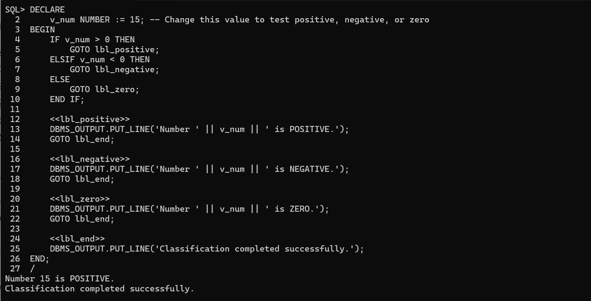
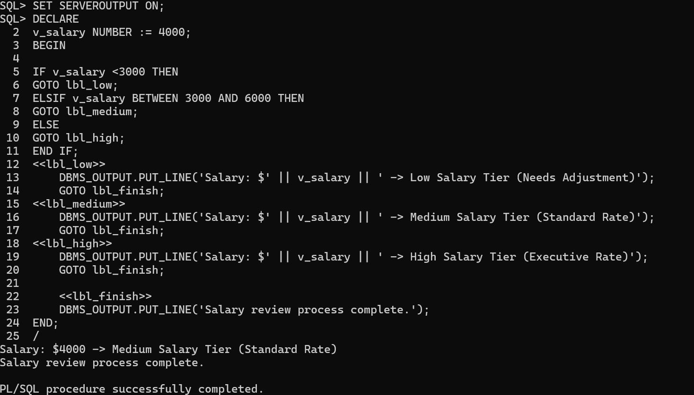
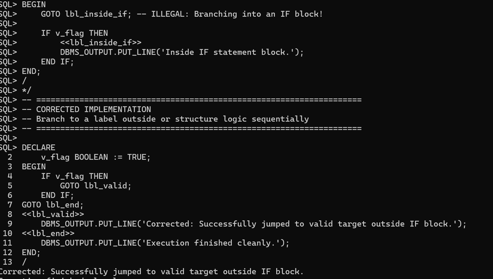
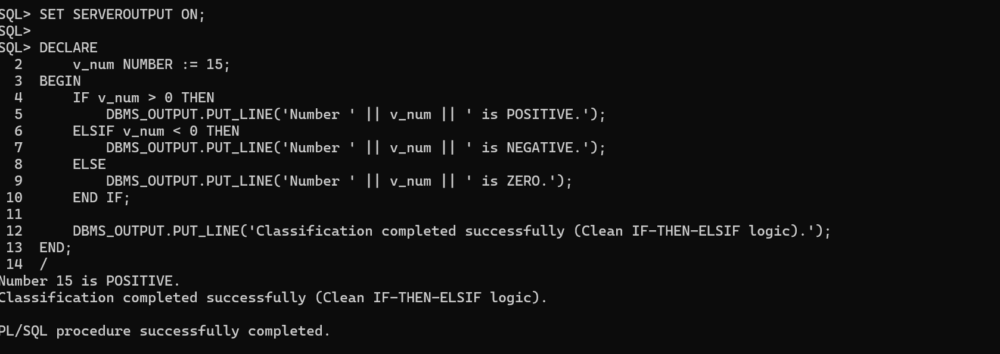
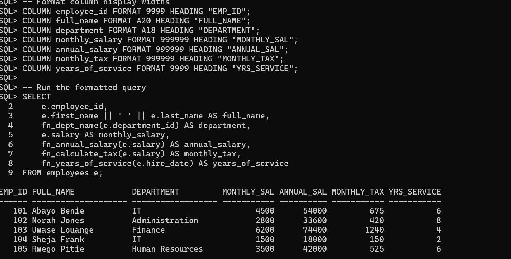
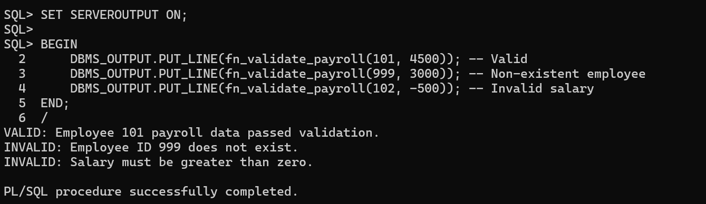

# Oracle PL/SQL GOTO Statements and Functions Report

**Course:** Database Development with PL/SQL (INSY 8311)  
**Instructor:** Eric Maniraguha  
**Student Name:** Bwiza Janviere  
**Student ID:** 20251SEN243  

---

## Submission Details
- **Repository Link:** https://github.com/BWIZAjanvy/plsql-goto-functions-20251SEN243-Janviere
- **Database Used:** Oracle Database 21c Enterprise Edition / SQL*Plus
- **Issues Encountered:** Yes (Resolved text wrapping in SQL*Plus using `COLUMN ... FORMAT` and `SET LINESIZE`)

---

## Overview
This repository contains the practical deliverables for Individual Assignment III on PL/SQL control structures (`GOTO` statements), modular stored functions, exception handling, and payroll validation. All SQL scripts and PL/SQL blocks were executed and verified in Oracle Database 21c via SQL*Plus.

---

## Tasks & Execution Summary

### Part A: PL/SQL GOTO Control Structures

* **Task A1: Number Classifier**  
  

* **Task A2: Salary Review**  
  

* **Task A3: Illegal GOTO Demonstration & Fix**  
  

* **Task A4: Rewrite Without GOTO**  
  

---

### Part B: Stored Functions & SQL Integration

* **Task B5: Multi-Function SELECT Output**  
  

---

### Part C: Combined Payroll Validation Task

* **Task C1: Payroll Validation Output**  
  

---

## Challenges & Solutions
- **Challenge:** In SQL*Plus, running multi-column queries resulted in severe line wrapping across rows because string fields (`VARCHAR2`) defaulted to wide column widths.
- **Solution:** Configured SQL*Plus output options using `SET LINESIZE 200` and formatted individual display widths using `COLUMN <column_name> FORMAT A20` before running the `SELECT` query.

---

## Integrity Statement
"Excellence is never an accident; it is the result of discipline, commitment, and integrity."  
